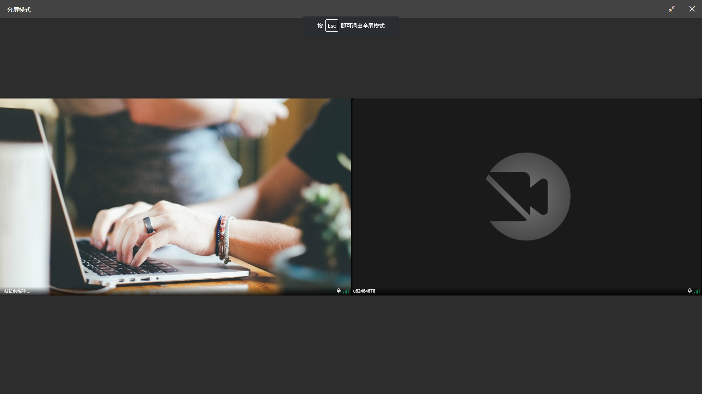
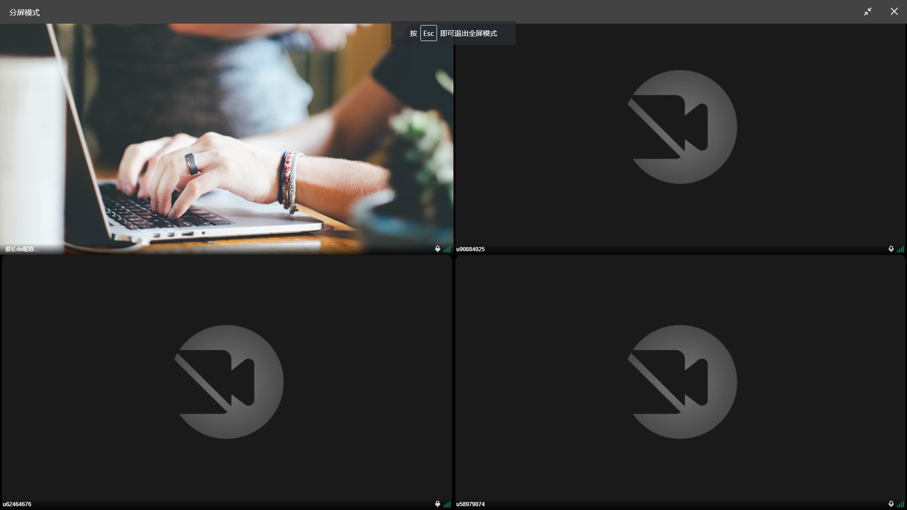
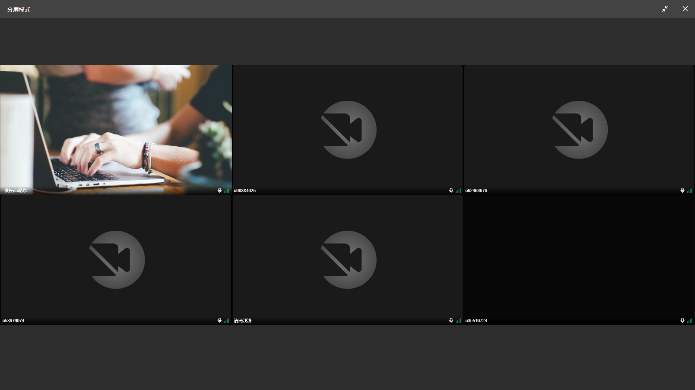
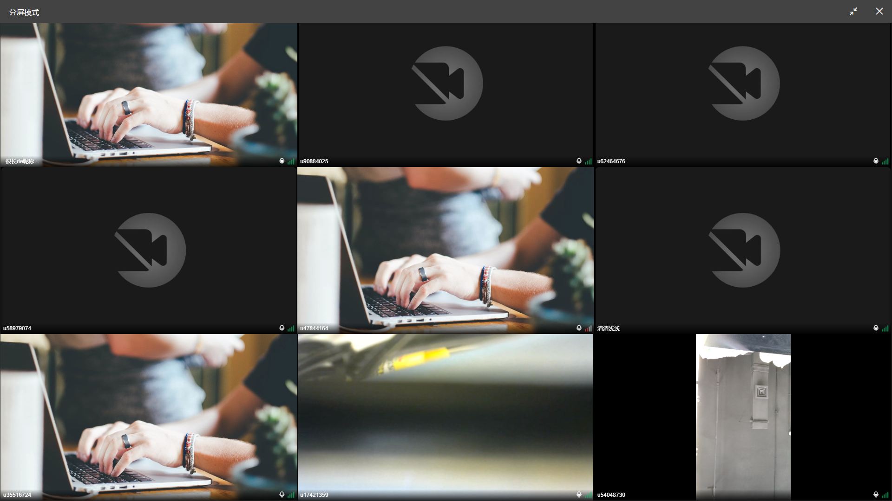
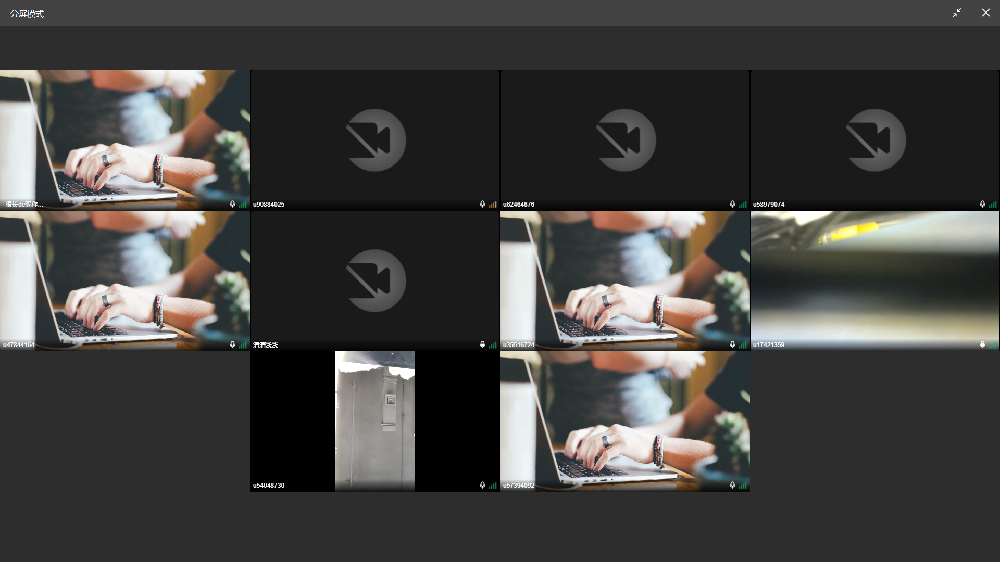

## 分屏组件

分屏组件主体，订阅上麦流以及推本地上麦流。

- stream-local 组件进行推路
- stream-remote 组件进行订阅流

保持和上麦流列表组件(stream-list)相同逻辑维护上麦列表，根据当前人上麦信息 localSpeaker 决定是否推流，根据 remoteSpeakers 遍历渲染远端流列表

### 流组件布局规则

定义 n 为流组件的数量

#### `n === 1`：一屏自适应铺满

#### `n > 1 && n <= 4`: 一行两个

#### `n > 4 && n <= 9`: 一行三个

#### `n > 4 && n <= 9`: 一行四个

